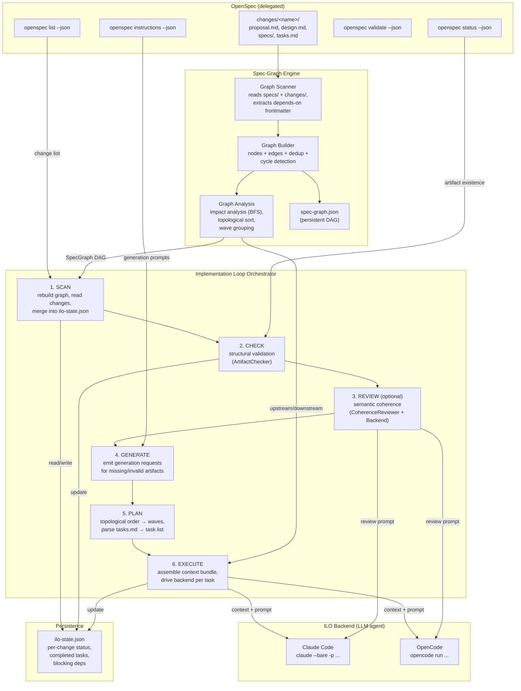

# Spec-Driven Framework — Architecture Overview

## System Context

The Spec-Driven Framework (SDF) extends [OpenSpec](https://github.com/codebeaver-ai/openspec) with two capabilities that OpenSpec lacks:

1. **Cross-spec dependency tracking** (Spec-Graph Engine)
2. **Full implementation lifecycle orchestration** (ILO)

OpenSpec owns the single-change workflow. SDF adds the multi-change coordination layer on top.

## End-to-End Workflow



## Component Responsibilities

### OpenSpec (external — delegated, never reimplemented)

| What it owns | How SDF uses it |
|---|---|
| Artifact schema (proposal → design → specs → tasks) | SDF reads these files, never invents its own format |
| Single-change workflow lifecycle | `openspec status --json` for artifact readiness |
| Generation instructions (what to write next) | `openspec instructions --json` enriches ILO generate requests |
| Structural validation of individual artifacts | `openspec validate --json` (supplemented by ArtifactChecker) |
| Change discovery and listing | `openspec list --json` is the source of truth for what changes exist |

### Spec-Graph Engine (SDF component — cross-change relationships)

| What it owns | What it does NOT do |
|---|---|
| Persistent DAG of specs + changes (`spec-graph.json`) | Does not modify OpenSpec files |
| Dependency extraction from `depends-on` frontmatter | Does not infer implicit deps (v1) |
| Cross-reference detection from markdown links | Does not validate artifact content |
| Impact analysis: upstream context + downstream affected | Does not execute anything |
| Topological sort with parallel wave grouping | Does not track implementation progress |
| Cycle detection with error reporting | Does not generate artifacts |

**Key APIs:** `scan()`, `build()`, `computeImpact()`, `topologicalSort()`, `groupWaves()`

### ILO — Implementation Loop Orchestrator (SDF component — lifecycle coordination)

| Phase | What it does | Delegates to |
|---|---|---|
| **1. Scan** | Rebuilds spec-graph, reads OpenSpec change list, merges into `ilo-state.json` | Spec-Graph (`build()`), OpenSpec (`list --json`) |
| **2. Check** | Validates artifact structural completeness (headings, sections, checkboxes) | `ArtifactChecker`, OpenSpec (`status --json`) |
| **3. Review** *(optional)* | Semantic coherence validation — alignment, contradictions, completeness | `CoherenceReviewer` → `ILOBackend` (LLM) |
| **4. Generate** | Emits structured generation requests for missing/invalid artifacts | OpenSpec (`instructions --json`) for prompts |
| **5. Plan** | Produces execution plan — topological waves with ordered tasks | `ExecutionPlanner`, Spec-Graph (`topologicalSort()`) |
| **6. Execute** | Assembles context bundles, drives backend for each task, tracks progress | `ContextAssembler`, `ILOBackend` |

**What ILO does NOT do:**
- Write code (the backend does)
- Generate specs/designs itself (it emits requests; the backend writes them)
- Make decisions about what to implement (the spec-graph determines order)
- Manage git (commits, branches, PRs are the user's or agent's job)

### ArtifactChecker (ILO sub-component — structural validation)

Checks that artifacts follow expected conventions:

| Artifact | What it checks |
|---|---|
| `proposal.md` | Has Purpose/Problem/Why section + Capabilities/Scope/What Changes section |
| `design.md` | Has Context + Goals/Non-Goals + Decisions sections; proposal.md exists |
| `specs/*.md` | Has Requirement sections + Scenario sections |
| `tasks.md` | Has checkbox tasks (`- [ ]`/`- [x]`) + numbered section headings |

This is **structural** — it checks that sections exist, not that their content is correct.

### CoherenceReviewer (ILO sub-component — semantic validation, optional)

Uses the LLM backend to check what structural validation cannot:

| Category | Example |
|---|---|
| **Alignment** | Does the design actually address the proposal's stated goals? |
| **Contradiction** | Do two specs within the same change conflict? |
| **Completeness** | Does the proposal list capabilities that have no corresponding specs? |
| **Cross-change coherence** | Do specs from change A conflict with specs from change B? |

### ContextAssembler (ILO sub-component — graph-aware context)

Builds self-contained context bundles for agent task execution:

```
ContextBundle = {
  task info (id, description, change)
  + proposal.md (full text)
  + design.md (full text)
  + specs/*.md (all spec files for this change)
  + upstream specs (from spec-graph — what this change depends on)
  + upstream changes (proposals/designs of dependency changes)
  + downstream specs (for awareness — what this change affects)
}
```

Token budget truncation removes least-relevant context when the bundle exceeds `maxTokens`.

### ExecutionPlanner (ILO sub-component — task ordering)

- Parses `tasks.md` checkbox format into structured task items
- Uses spec-graph topological sort to determine change execution order
- Groups independent changes into parallel waves (Kahn's algorithm)
- Skips already-completed tasks (from `ilo-state.json`)

## Data Flow Summary

```mermaid
flowchart LR
    subgraph Inputs
        SPECS["openspec/specs/"]
        CHANGES["openspec/changes/"]
        FRONTMATTER["depends-on frontmatter"]
    end

    subgraph Processing
        GRAPH["Spec-Graph<br/>scan → build → analyze"]
        CHECKER["ArtifactChecker<br/>structural validation"]
        REVIEWER["CoherenceReviewer<br/>semantic validation"]
        ASSEMBLER["ContextAssembler<br/>graph-aware bundles"]
        PLANNER["ExecutionPlanner<br/>wave ordering"]
    end

    subgraph Outputs
        SGJ["spec-graph.json"]
        ISJ["ilo-state.json"]
        GENREQ["Generation requests<br/>(structured JSON)"]
        CTXBUNDLE["Context bundles<br/>(markdown/JSON)"]
        EXECPLAN["Execution plan<br/>(waves + tasks)"]
    end

    SPECS --> GRAPH
    CHANGES --> GRAPH
    FRONTMATTER --> GRAPH
    GRAPH --> SGJ
    CHANGES --> CHECKER
    CHECKER --> ISJ
    CHANGES --> REVIEWER
    REVIEWER --> ISJ
    GRAPH --> ASSEMBLER
    CHANGES --> ASSEMBLER
    ASSEMBLER --> CTXBUNDLE
    GRAPH --> PLANNER
    PLANNER --> EXECPLAN
    CHECKER --> GENREQ
end
```

## CLI Surface

```
sdf graph build              # Rebuild spec-graph.json from OpenSpec directories
sdf graph impact --changed X # Show upstream context + downstream affected for spec X
sdf graph order              # Print topological execution order with waves
sdf graph show [--json]      # Display the full graph

sdf ilo run [--change X] [--dry-run] [--review]  # Run the full loop
sdf ilo status [--json]      # Show current loop state
sdf ilo check [--change X]   # Run structural + optional semantic checks
sdf ilo plan [--change X]    # Generate execution plan without executing
sdf ilo review [--change X]  # Run semantic coherence review only
```

## Key Design Principles

1. **Delegate to OpenSpec** — never reimplement what OpenSpec provides (discovery, artifact schema, instructions)
2. **Deterministic orchestration** — the loop itself uses no LLM reasoning; only the backends (execute, review) use LLMs
3. **Graph-aware context** — every task gets upstream/downstream context from the spec-graph, not just its own change
4. **Structural first, semantic optional** — the checker is fast and deterministic; the reviewer is powerful but optional
5. **Backend-agnostic** — ILO works with any `ILOBackend` implementation (Claude Code, OpenCode, future agents)
6. **Zero agent frameworks** — the workflow is a deterministic loop, not an LLM decision tree
