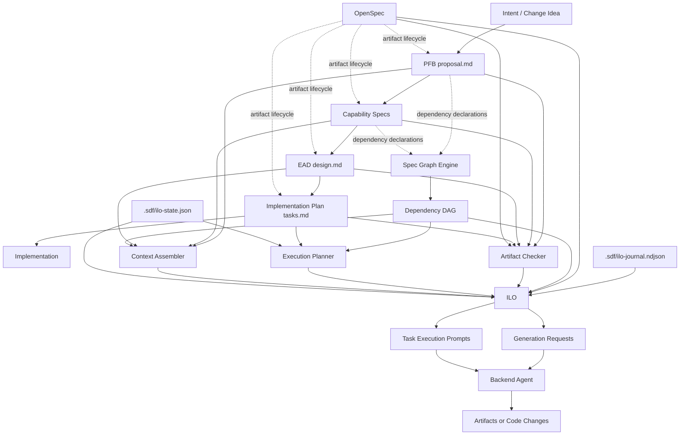

# Spec-Driven Framework Information Architecture

## Purpose

This document defines where information belongs in the repository and how the major components relate to each other. It complements the high-level OpenSpec specs by explaining the repository's information architecture in plain language.

## Repository Taxonomy

### `docs/`

Use `docs/` for explanatory and evolving project material:

- workplans and roadmap material
- implementation logs and session notes
- testing strategy and validation notes
- architecture narrative and exploratory diagrams
- tool comparisons and research

### `openspec/specs/`

Use `openspec/specs/` for durable, normative contracts:

- SDD lifecycle rules
- artifact structure and traceability rules
- graph behavior and orchestration contracts
- backend integration contracts
- portability guarantees

### `openspec/changes/`

Use `openspec/changes/` for concrete implementation initiatives that add or modify framework capabilities.

## Spec Taxonomy

### Methodology specs

These define the high-level workflow model and artifact semantics:

- `sdd-lifecycle`
- `sdd-product-feature-brief`
- `sdd-engineering-architecture-doc`
- `sdd-implementation-plan`
- `sdd-spec-graph`

### Framework contract specs

These define the architecture boundaries of the framework itself:

- `framework-architecture`
- `artifact-traceability`
- `backend-contract`
- `repo-portability`

### Product capability specs

These define concrete behavior that the framework must implement:

- `graph-scanner`
- `graph-manifest`
- `graph-analysis`
- `graph-cli`
- `artifact-checker`
- `context-assembler`
- `loop-engine`
- `loop-cli`
- `loop-skills`

## Component Map

| Component | Input | Output | Dependencies | Owner |
|---|---|---|---|---|
| SDD lifecycle | change intent | artifact order and review gates | methodology specs | framework |
| PFB / `proposal.md` | problem, scope, capabilities | root change intent | lifecycle, OpenSpec | human or agent |
| Specs | PFB capabilities | testable requirements | PFB, OpenSpec | human or agent |
| EAD / `design.md` | PFB and specs | technical decisions | specs, PFB | human or agent |
| Implementation plan / `tasks.md` | PFB, specs, EAD | ordered executable tasks | EAD, specs | human or agent |
| OpenSpec | change and spec artifacts | status, instructions, validate output | OpenSpec CLI | OpenSpec |
| Spec Graph | specs, proposals, dependency declarations | DAG, impact analysis, execution waves | OpenSpec directory structure | framework |
| Artifact Checker | change artifacts, OpenSpec status | completeness and coherence report | OpenSpec, files | ILO layer |
| Context Assembler | task, artifacts, graph | context bundle | graph, change artifacts | ILO layer |
| Execution Planner | graph, tasks, loop state | execution waves and blocked changes | graph, tasks, state | ILO layer |
| State Manager | scan, check, execution progress | `.sdf/ilo-state.json` | filesystem | ILO layer |
| Journal Manager | phase transitions, task lifecycle, backend summaries | `.sdf/ilo-journal.ndjson` | filesystem | ILO layer |
| Trace Manager | opt-in raw backend traces | `.sdf/traces/` | filesystem | ILO layer |
| ILO | changes, graph, checker, planner, backend | generation requests, plans, execution prompts | OpenSpec, Spec Graph, backend | framework |
| Backend agent | execution prompt | drafted artifact or code change | Claude Code, OpenCode, or similar | agent runtime |

## PR #1 Alignment Review

### Aligned with the intended architecture

- OpenSpec integration is isolated behind `OpenSpecCLIClient`
- ILO is modeled as an orchestration layer rather than as an authoring engine
- state, checking, context assembly, planning, and loop coordination are separated into services
- methodology specs and capability specs already exist in `openspec/specs/`

### Partially aligned

- the ILO depends conceptually on the spec graph, but the CLI still uses a stub empty graph
- the backend contract exists in types, but no concrete Claude Code or OpenCode backend is implemented
- the checker and context assembler describe deeper OpenSpec delegation than the current code performs

### Gaps still open

- graph CLI and graph engine are not fully wired into runtime commands
- skill generation is specified but not implemented
- MCP delivery surface is still conceptual
- cross-change coherence checks are still thinner than the specs describe

## Mermaid

## Rule of Thumb

- Put explanatory material in `docs/`
- Put durable system contracts in `openspec/specs/`
- Put implementation initiatives in `openspec/changes/`

If a document explains, compare it, or explore it, it belongs in `docs/`. If it constrains the framework, defines ownership, or can be validated by the system, it belongs in `openspec/specs/`.
